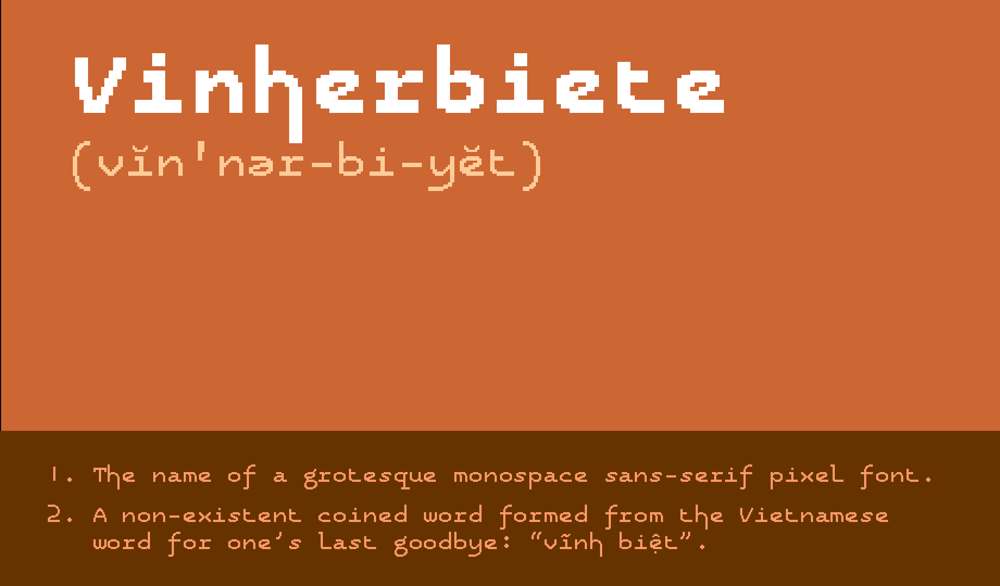
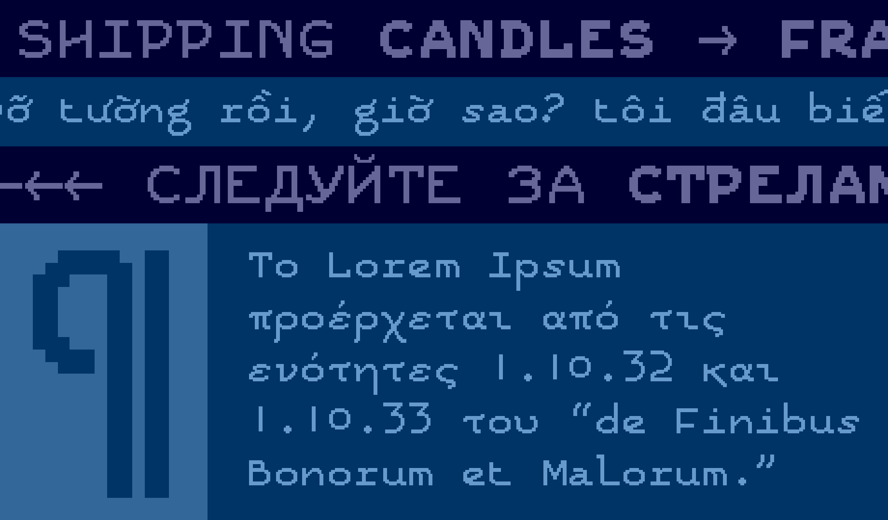
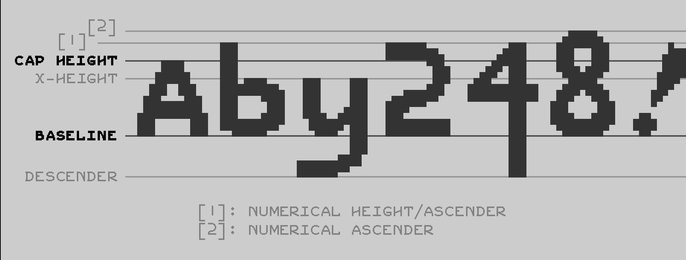

# Vinherbiete

Vinherbiete is a grotesque monospace sans-serif pixel font, created using FontStruct.

## Download

You can download the font via the [latest release](https://github.com/Catterio/Vinherbiete/releases/latest).

## Language support

The font supports 107 languages, as detected by [FontDrop's language report](https://fontdrop.info/#/languages?darkmode=true).

Belarusian, Bosnian, Bulgarian, Chechen, Macedonian, Russian, Serbian, Ukrainian, Uzbek, Greek, Afrikaans, Albanian, Asu, Basque, Bemba, Bena, Breton, Catalan, Chiga, Colognian, Cornish, Croatian, Czech, Danish, Dutch, Embu, English, Esperanto, Estonian, Faroese, Filipino, Finnish, French, Friulian, Galician, Ganda, German, Gusii, Hungarian, Icelandic, Inari Sami, Indonesian, Irish, Italian, Jola-Fonyi, Kabuverdianu, Kalaallisut, Kalenjin, Kamba, Kikuyu, Kinyarwanda, Latvian, Lithuanian, Lower Sorbian, Luo, Luxembourgish, Luyia, Machame, Makhuwa-Meetto, Makonde, Malagasy, Maltese, Manx, Meru, Morisyen, Northern Sami, North Ndebele, Norwegian Bokmål, Norwegian Nynorsk, Nyankole, Oromo, Polish, Portuguese, Quechua, Romanian, Romansh, Rombo, Rundi, Rwa, Samburu, Sango, Sangu, Scottish Gaelic, Sena, Serbian, Shambala, Shona, Slovak, Slovenian, Soga, Somali, Spanish, Swahili, Swedish, Swiss, German, Taita, Teso, Turkish, Upper Sorbian, Uzbek (Latin), Vietnamese, Volapuk, Vunjo, Walser, Welsh, Western Frisian, Zulu.
